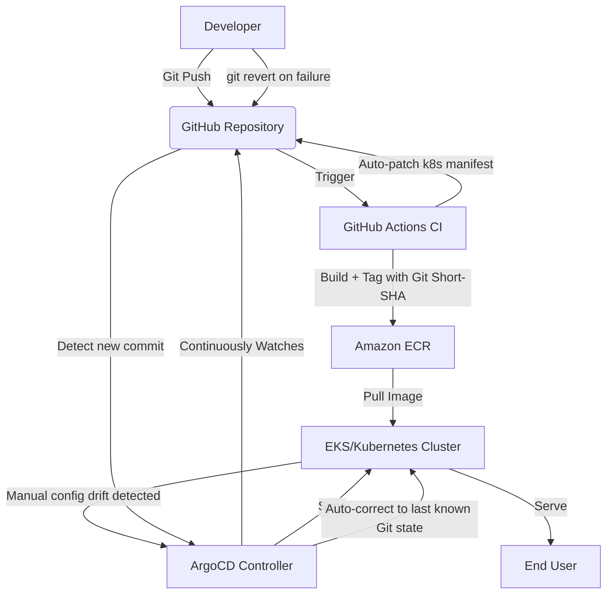

# project-kratos

**Executive Summary** : Designed to tackle business revenue loss caused by slow manual rollbacks, Project Kratos provides a self-healing GitOps infrastructure. Configuration drift is automatically detected and corrected by ArgoCD, while application-level failures are resolved through a fast, Git-based semi-automated rollback — reducing recovery time from hours to minutes.




## Key Features

**Infra as Code**: Multi-environment (Staging/Prod) setup using Terraform with remote state locking.

**Self-healing GitOps**: Automated configuration drift detection and correction via ArgoCD — any manual change to cluster state is auto-reverted to match Git.

**Fast Git-Based Recovery**: When application-level issues occur, recovery is a single `git revert` away — ArgoCD detects the new commit and syncs the cluster to the last known good state within seconds, cutting recovery time from hours to minutes.

> 🚧 **Roadmap:** Automated canary rollbacks driven by real-time Prometheus 5xx-error monitoring are planned for a future phase. The current implementation handles recovery via ArgoCD self-heal (config drift) and Git-based revert (application bugs).


## 📂 Directory Structure

```plaintext
project-kratos/
├── .github/workflows/   # CI Pipelines (Build & Test)
├── terraform/           # Infrastructure as Code
│   ├── environments/    # Staging & Prod configs
│   └── modules/         # Reusable VPC, K8s modules
├── k8s/          # K8s Manifests (Helm/Kustomize)
├── app/                 # Application Source Code
└── README.md            # Project Documentation
```


## 🏗️ Architecture Progress Log

### Phase 1: Networking & Core Foundation (Completed)
- **Custom VPC:** Designed and deployed a custom AWS VPC with a `10.0.0.0/16` CIDR block.
- **Subnet Layout:** Configured 2 Public Subnets (for Internet-facing resources like Load Balancers) and 2 Private Subnets across multiple Availability Zones (`us-east-1a` and `us-east-1b`) for secure workloads.
- **Routing & Gateways:** Implemented an Internet Gateway (IGW) for public routing and a NAT Gateway with an Elastic IP to allow secure outbound traffic from private subnets.
- **Resource Tagging:** Standardized mandatory tags (`Environment`, `Project`, `ManagedBy`) across all network components.

### Phase 1.5: Security & Identity Gateways (Completed)
- **IAM Cluster Role:** Created the AWS IAM Role with `AmazonEKSClusterPolicy` for control plane operations.
- **IAM Node Group Role:** Configured worker node execution roles with mandatory CNI, WorkerNode, and Container Registry read-only permissions.
- **Control Plane Security Group:** Configured rigid ingress rules restricting port `443` management traffic.
- **Worker Nodes Security Group:** Established secure internal cluster communication boundaries, allowing control plane routing and outbound internet access while blocking unauthorized external exposure.

## 🏗️ Phase 2 Complete: EKS Cluster Setup
Successfully implemented the core computing infrastructure for Project Kratos.
- Configured **AWS EKS Cluster (Control Plane)** with strict IAM role access controls.
- Deployed **EKS Node Group (Worker Nodes)** running inside isolated Private Subnets with auto-scaling configuration (`min: 1, desired: 2, max: 3`).
- Bound all components seamlessly using Terraform multi-module variable mappings and cross-referencing.


## Phase 3: Continuous Integration & Automated Artifact Delivery

In this phase, manual infrastructure clicks were completely eliminated by moving the core artifact storage and security layers into code. A secure, optimized, and automated CI pipeline was built to build and deliver containerized application updates.

### Key Implementations:
* **Infrastructure Isolation:** Separated core state resources (AWS ECR & IAM OIDC Role) into a bootstrap infrastructure pipeline to preserve data and avoid unnecessary AWS compute costs during local teardowns.
* **Hardened Dockerfile:** Configured a minimal footprint `nginx:alpine` image, structured precise working directories, and explicitly exposed port `80`.
* **Zero-Secret Authentication:** Implemented AWS OpenID Connect (OIDC) federation within GitHub Actions, enabling the runner to assume short-lived IAM roles without storing static, high-risk AWS Access Keys.
* **Immutable Tagging:** Automated immutable image tagging utilizing Git short-SHA commits alongside the `latest` tracking tag to ensure perfect rollback capabilities.

### Pipeline Architecture Flow:
1. Developer pushes code to the `main` branch.
2. GitHub Actions runner spins up and checks out the code.
3. Runner assumes AWS IAM Role securely via OIDC.
4. Docker Buildx initializes cache-optimized layers.
5. Custom image builds, tags with Git Short-SHA, and pushes to Amazon ECR.

## Phase 4: GitOps Configuration & Kubernetes Manifests
- **Declarative Manifests:** Formulated production-ready Kubernetes Deployment and NodePort Service configurations.
- **Automated GitOps Bridge:** Upgraded the CI engine to automatically patch the tracking manifests with newly minted container tags and safely push back via `[skip ci]` token mechanics.

---

## 🛠️ Tech Stack Used
- **Cloud Provider:** Amazon Web Services (AWS)
- **Infrastructure as Code:** Terraform (Modular Architecture)
- **Target Platform:** Amazon Elastic Kubernetes Service (EKS)