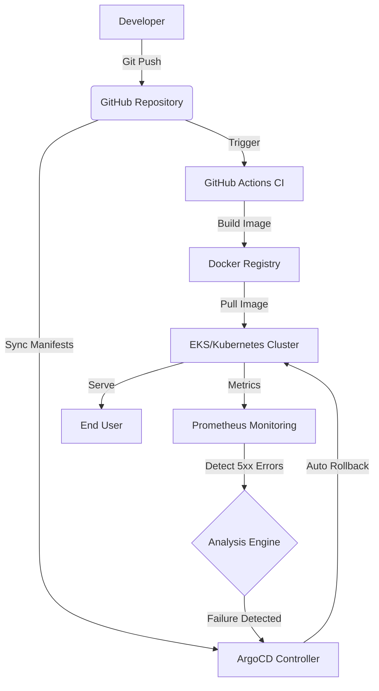

# project-kratos

**Executive Summary** : Designed to tackle business revenue loss caused by slow manual rollbacks, Project Kratos provides a self-healing infrastructure. By automating the detection and recovery process, it achieves near-zero downtime through intelligent, automated deployment rollbacks.




## Key Features

**Infra as Code**: Multi-environment (Staging/Prod) setup using Terraform with remote state locking.

**Self-healing GitOps**: Automated drift detection and correction via ArgoCD

**Automated Canary Rollbacks**: Real-time monitoring of 5xx errors with 60-second automated rollbacks.


## 📂 Directory Structure

```plaintext
project-kratos/
├── .github/workflows/   # CI Pipelines (Build & Test)
├── terraform/           # Infrastructure as Code
│   ├── environments/    # Staging & Prod configs
│   └── modules/         # Reusable VPC, K8s modules
├── kubernetes/          # K8s Manifests (Helm/Kustomize)
├── src/                 # Application Source Code
└── README.md            # Project Documentation
```


## 🏗️ Architecture Progress Log

### Phase 1: Networking & Core Foundation (Completed)
- **Custom VPC:** Designed and deployed a custom AWS VPC with a `10.0.0.0/16` CIDR block.
- **Subnet Layout:** Configured 2 Public Subnets (for Internet-facing resources like Load Balancers) and 2 Private Subnets across multiple Availability Zones (`us-east-1a` and `us-east-1b`) for secure workloads.
- **Routing & Gateways:** Implemented an Internet Gateway (IGW) for public routing and a NAT Gateway with an Elastic IP to allow secure outbound traffic from private subnets.
- **Resource Tagging:** Standardized mandatory tags (`Environment`, `Project`, `ManagedBy`) across all network components.

### Phase 1.5: Security & Identity Gateways (Completed)
- **IAM Cluster Role:** Created the AWS IAM Role with `AmazonEKSClusterPolicy` for control plane operations.
- **IAM Node Group Role:** Configured worker node execution roles with mandatory CNI, WorkerNode, and Container Registry read-only permissions.
- **Control Plane Security Group:** Configured rigid ingress rules restricting port `443` management traffic.
- **Worker Nodes Security Group:** Established secure internal cluster communication boundaries, allowing control plane routing and outbound internet access while blocking unauthorized external exposure.

---

## 🛠️ Tech Stack Used
- **Cloud Provider:** Amazon Web Services (AWS)
- **Infrastructure as Code:** Terraform (Modular Architecture)
- **Target Platform:** Amazon Elastic Kubernetes Service (EKS)