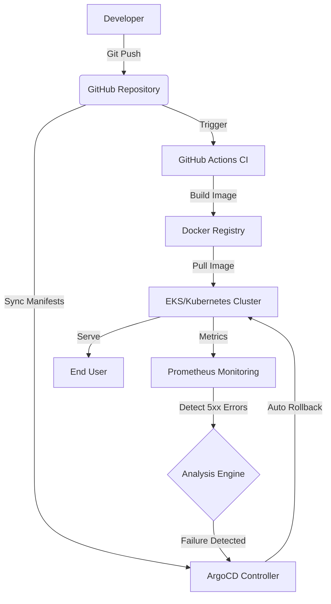

# project-kratos

**Executive Summary** : Designed to tackle business revenue loss caused by slow manual rollbacks, Project Kratos provides a self-healing infrastructure. By automating the detection and recovery process, it achieves near-zero downtime through intelligent, automated deployment rollbacks.




## Key Features

**Infra as Code**: Multi-environment (Staging/Prod) setup using Terraform with remote state locking.

**Self-healing GitOps**: Automated drift detection and correction via ArgoCD

**Automated Canary Rollbacks**: Real-time monitoring of 5xx errors with 60-second automated rollbacks.


## 📂 Directory Structure

```plaintext
project-kratos/
├── .github/workflows/   # CI Pipelines (Build & Test)
├── terraform/           # Infrastructure as Code
│   ├── environments/    # Staging & Prod configs
│   └── modules/         # Reusable VPC, K8s modules
├── kubernetes/          # K8s Manifests (Helm/Kustomize)
├── src/                 # Application Source Code
└── README.md            # Project Documentation
```

